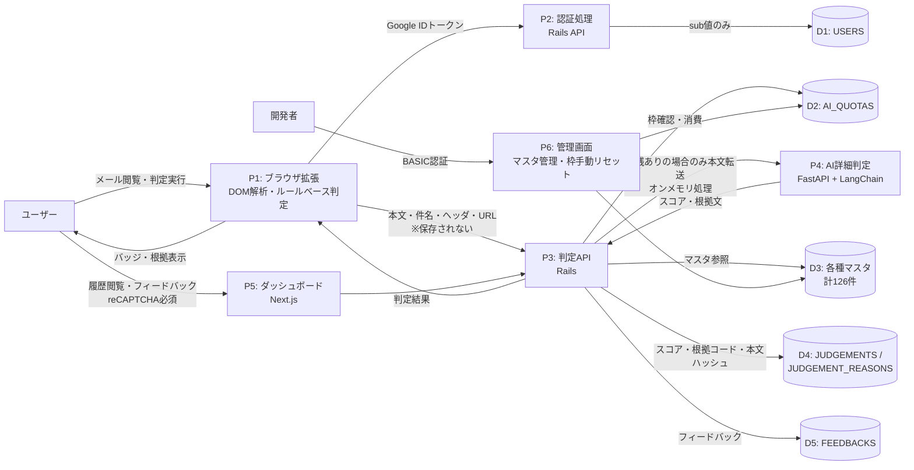
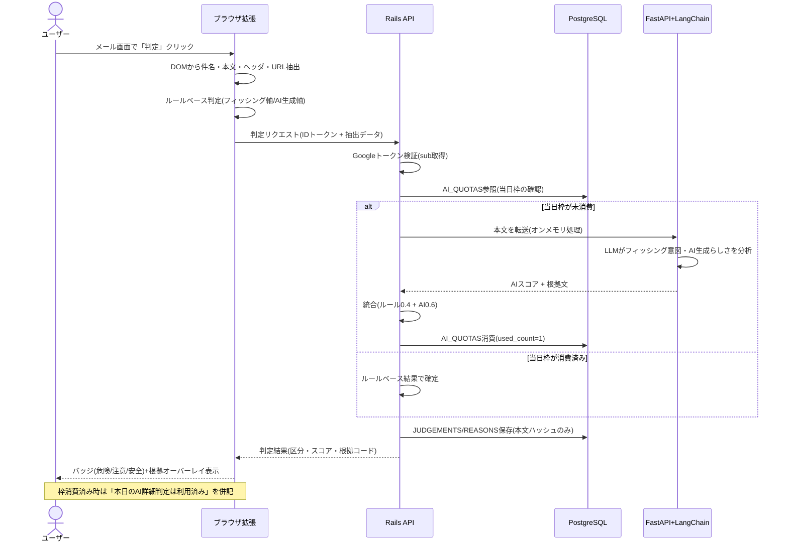
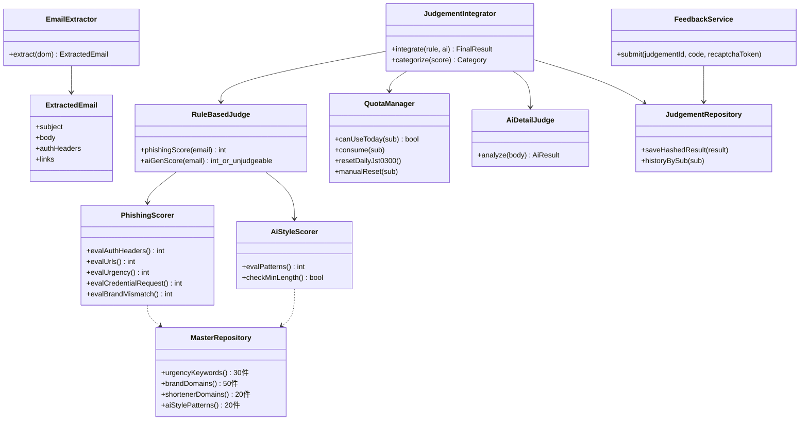
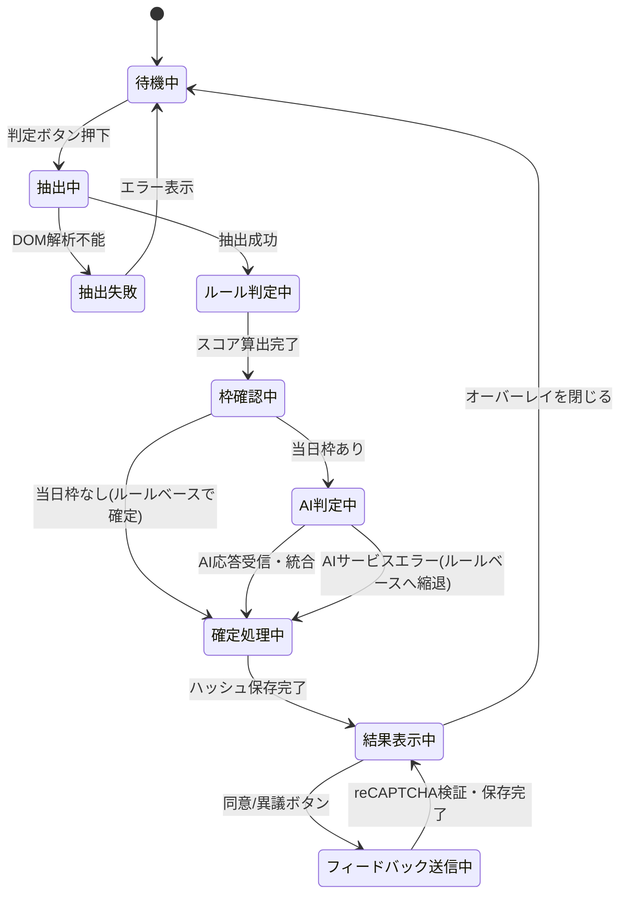
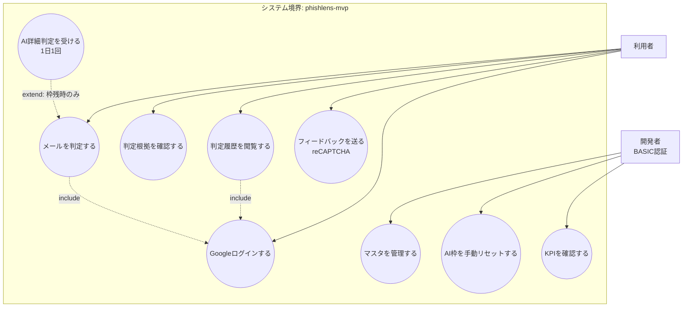

# phishlens-mvp 設計資料

**課題:** 生成AI製フィッシングメールを判定するブラウザ拡張
**対象エディション:** MVP(需要調査)
**プラットフォーム:** ウェブ(ブラウザ拡張 + Webダッシュボード)
**リポジトリ名:** `phishlens-mvp`

---

## 1. 仕様書

### 1.1 目的

Webメール(Gmail等)上で閲覧中のメールについて、「フィッシングである可能性」と「生成AIで作成された可能性」を2軸で判定し、ユーザーに警告表示するブラウザ拡張のMVP。実需(継続利用)があるかを検証する。

### 1.2 システム構成

| コンポーネント | 技術 | デプロイ先 |
|---|---|---|
| ブラウザ拡張 | Chrome拡張 Manifest V3 / TypeScript | Chrome Web Store(手動配布) |
| ダッシュボード(フロント) | Next.js / TypeScript | Vercel(無料) |
| APIバックエンド | Rails(Ruby) | Railway(無料)、不可時のみRender |
| AI判定サービス | FastAPI(Python) + LangChain(LangSmithで観測) | Railway(無料)、不可時のみRender |
| DB | PostgreSQL(本番) / SQLite(開発環境) | Railway |
| 管理画面 | Rails管理画面(BASIC認証) | Railway |

- 認証はGoogleログイン。拡張はchrome.identity経由でGoogle OAuthを行い、バックエンドはIDトークン検証後、opaqueなユーザーID(sub値)のみ保持する。
- ダッシュボードのフィードバック送信フォームにはreCAPTCHAを必須とする。
- AI詳細判定は無料プランでのAI利用として扱い、アカウントごとに1日1回(JST 03:00自動リセット、開発者が管理画面から手動リセット可能)。

### 1.3 機能一覧

| # | 機能 | 概要 |
|---|---|---|
| F1 | メール解析トリガ | Webメール画面でメール本文DOMを検出し「判定」ボタンを表示 |
| F2 | ルールベース判定 | 拡張内でフィッシングスコア・AI生成スコアを算出(回数無制限) |
| F3 | AI詳細判定 | LangChain経由でLLMが意図・根拠を分析(1日1回/アカウント) |
| F4 | 判定結果表示 | 危険/注意/安全のバッジと根拠リストをオーバーレイ表示 |
| F5 | 判定履歴 | ダッシュボードでスコア履歴を閲覧(本文は保存しない) |
| F6 | フィードバック | 判定への同意/異議を送信(reCAPTCHA必須) |
| F7 | 管理機能 | マスタ管理・AI利用枠の手動リセット(BASIC認証) |

### 1.4 中核判定ロジック(自然言語・確定版 v4)

**関数:** `judgeEmail(件名, 本文, ヘッダ情報, リンク一覧, アカウント情報) → 判定結果`

**A. フィッシングスコア(0〜100)**

1. 認証ヘッダ評価: SPF/DKIM/DMARCがすべてpassなら−30点、いずれかfailなら+30点、ヘッダ取得不能なら0点。
2. URL評価: 表示テキストとhrefのドメイン不一致+25点、短縮URLマスタ該当+10点、punycodeまたはIPアドレス直打ちURL+25点、ブランドドメインマスタと編集距離1〜2の類似偽ドメイン+30点。
3. 緊急性・脅迫表現: 緊急性キーワードマスタ1件マッチごとに+5点(上限+20点)。
4. 認証情報・個人情報の入力要求表現: +20点。
5. 送信者表示名がブランドマスタに含まれるのに送信ドメインが不一致: +25点。
6. 合計を0〜100にクリップ。

**B. AI生成スコア(0〜100または「判定不能」)**

1. 本文が200文字未満の場合は「判定不能」を返す(誤判定防止)。
2. AI文体特徴パターンマスタ(文長の分散が極端に小さい、完璧すぎる定型敬語、具体的固有情報を欠く汎用表現、誤字ゼロかつテンプレ的段落構造、翻訳調の不自然さの不在 等)のマッチごとに+10〜20点を加算し、0〜100にクリップ。

**C. AI詳細判定(1日1回/アカウント)**

1. 当日の利用枠が未消費なら、本文をAI判定サービスへ送信し、LLMがフィッシング意図・AI生成らしさ・根拠文を返す。最終スコア=ルールベース0.4 + AI判定0.6の重み付け統合。送信した本文はオンメモリ処理のみで保存しない。
2. 消費済みならルールベース結果のみで確定し、「本日のAI詳細判定は利用済み」と表示する。

**D. 総合判定**

フィッシングスコア60以上=危険、30〜59=注意、30未満=安全。AI生成スコアは補助情報として併記し、それ単独では危険度を上げない(AI製の正規メールが存在するため)。すべての加点・減点要素は根拠コードとして結果に添付する。

### 1.5 テスト設計と評価ループの記録

フィッシング有無(2) × AI生成有無(2) × 認証ヘッダ(pass/fail/なし=3) × URL(正常/偽装/なし=3) × 言語(日/英=2) = 72組み合わせに、境界8ケース(空本文、HTMLのみ、添付のみ、極端な長文、緊急語を多用する正規メルマガ、AI枠消費済み、punycode URL、本文がURLのみ)を加えた計80ケース。

| 版 | 変更点 | 結果 | 発見された欠陥 |
|---|---|---|---|
| v1 | 単一スコア方式 | 58/80 (72.5%) | 正規セール告知の誤検知、AI製正規メールの危険誤判定 |
| v2 | 2軸分離、認証pass時の減点導入 | 68/80 (85.0%) | punycode偽装の見逃し、AI枠消費済み時の挙動未定義 |
| v3 | punycode/IP URL検出追加、枠消費時はルールベース確定と仕様化 | 79/80 (98.75%) | 空本文・URLのみメールでAI生成スコア算出不能 |
| v4 | AI生成スコアに「判定不能」を正式出力値として追加 | **80/80 (100%)** | — |

### 1.6 マスタデータ件数(MVP・明示)

| マスタ | 件数 |
|---|---|
| 緊急性キーワードマスタ | 30件 |
| ブランドドメインマスタ | 50件 |
| 短縮URLドメインマスタ | 20件 |
| AI文体特徴パターンマスタ | 20件 |
| 判定区分マスタ(危険/注意/安全) | 3件 |
| フィードバック区分マスタ(同意/異議/不明) | 3件 |
| **合計** | **126件** |

> **注記:** MVPでは需要調査を目的とするため、上記の最小単位のマスタデータでしかテストできない。実運用規模のブランド網羅(数千件規模)や多言語パターンでの検証は本エディションの範囲外である。

### 1.7 個人情報の取り扱い(MVP適用ルール準拠)

- ユーザー識別はGoogleログインのopaqueなsub値のみ保持し、メールアドレスは保存しない。表示名はGoogleアカウントの表示名のみ使用可。
- 生年月日・氏名・住所・電話番号は一切扱わない。
- 判定対象のメール件名・本文・送信元アドレスはDBに保存しない。履歴にはスコア・判定区分・根拠コード・本文のSHA-256ハッシュのみ保存する(同一メールの再判定検出用)。
- AI判定サービスへ送信された本文はオンメモリ処理のみとし、ログにも残さない(LangSmithのトレースは本文マスキング設定とする)。

### 1.8 非機能要件(MVP範囲)

- 保守・監視はMVPの範囲外(製品ライン定義どおり)。測定として、判定実行数・AI枠消費率・フィードバック率をKPIとしてダッシュボード集計する。
- 開発環境DBはSQLite、本番はPostgreSQL。
- 管理画面はBASIC認証、フィードバック送信はreCAPTCHA必須。

---

## 2. ER図

```mermaid
erDiagram
    USERS ||--o{ JUDGEMENTS : "実行する"
    USERS ||--|| AI_QUOTAS : "保有する"
    USERS ||--o{ FEEDBACKS : "送信する"
    JUDGEMENTS ||--o{ JUDGEMENT_REASONS : "根拠を持つ"
    JUDGEMENTS ||--o{ FEEDBACKS : "対象となる"
    JUDGEMENT_CATEGORIES ||--o{ JUDGEMENTS : "分類する"
    FEEDBACK_CATEGORIES ||--o{ FEEDBACKS : "分類する"
    URGENCY_KEYWORDS ||..o{ JUDGEMENT_REASONS : "参照される"
    BRAND_DOMAINS ||..o{ JUDGEMENT_REASONS : "参照される"
    SHORTENER_DOMAINS ||..o{ JUDGEMENT_REASONS : "参照される"
    AI_STYLE_PATTERNS ||..o{ JUDGEMENT_REASONS : "参照される"

    USERS {
        string google_sub PK "GoogleのopaqueなユーザーID"
        string display_name "Google表示名のみ"
        datetime created_at
    }
    AI_QUOTAS {
        string google_sub PK_FK
        date quota_date "JST基準日"
        int used_count "0または1"
        datetime reset_at "JST03:00自動リセット"
    }
    JUDGEMENTS {
        bigint id PK
        string google_sub FK
        string body_sha256 "本文ハッシュのみ保存"
        int phishing_score "0-100"
        int ai_gen_score "0-100 or NULL(判定不能)"
        string category_code FK "危険/注意/安全"
        boolean ai_detail_used
        datetime judged_at
    }
    JUDGEMENT_REASONS {
        bigint id PK
        bigint judgement_id FK
        string reason_code "加点減点要素コード"
        int score_delta
    }
    FEEDBACKS {
        bigint id PK
        bigint judgement_id FK
        string google_sub FK
        string feedback_code FK
        datetime created_at
    }
    JUDGEMENT_CATEGORIES {
        string code PK "3件"
        string label
        int threshold_min
    }
    FEEDBACK_CATEGORIES {
        string code PK "3件"
        string label
    }
    URGENCY_KEYWORDS {
        int id PK "30件"
        string keyword
        string lang
    }
    BRAND_DOMAINS {
        int id PK "50件"
        string brand_name
        string official_domain
    }
    SHORTENER_DOMAINS {
        int id PK "20件"
        string domain
    }
    AI_STYLE_PATTERNS {
        int id PK "20件"
        string pattern_code
        string description
        int weight "10-20"
    }
```

---

## 3. DFD(データフロー図)



---

## 4. シーケンス図



---

## 5. クラス図



---

## 6. 状態遷移図(1件の判定処理)



---

## 7. ユースケース図



---

## 付記

- 本資料はMVPのみを設計対象とし、他エディションとの比較・設計は含まない。
- MVPではマスタデータ計126件という最小単位のデータでしかテストできないため、実運用規模のデータ量・多様性での妥当性検証は本エディションでは実施不可能である旨を明記する。
